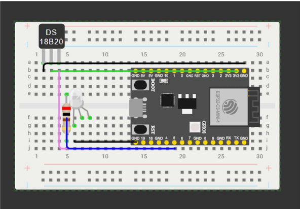

# Fridge Door Alert with ESP32-C3

This project is a simple IoT fridge door alert system built with an **ESP32-C3 SuperMini**, a **KY-035 Hall magnetic sensor**, and an **RGB LED**.

The system monitors the magnetic field produced by a magnet attached to the fridge door. Based on the sensor readings, it detects whether the door is open or closed. If the fridge door remains open for more than **5 seconds**, the LED turns on as a warning signal.

## Overview

The purpose of this project is to create a basic smart-home style alert system for a refrigerator door.

The magnetic sensor is placed near the fridge door and reads changes in the magnetic field depending on the position of the magnet attached to the door. The ESP32-C3 continuously reads the analog value from the sensor and compares it to a calibrated baseline interval.

- If the value stays in the baseline interval, the door is considered **open**
- If the value goes outside that interval, the door is considered **closed**
- If the door stays open for more than **5 seconds**, the LED turns on

This project is a simple example of using a microcontroller and a sensor to detect a real-world state and trigger a visual alert.

## Schematics Plan

**Schematic description**

The circuit is built on a breadboard and uses:
- an **ESP32-C3 SuperMini**
- a **KY-035 Hall magnetic sensor**
- an **RGB LED** used as a single-color warning LED
- a **220Ω resistor**

### Connections

#### KY-035 Hall sensor
- **GND** → **ESP32 GND**
- **VCC** → **ESP32 3.3V**
- **AO / Signal** → **ESP32 GPIO4**

#### RGB LED
- **Common cathode** (longest leg) → **ESP32 GND**
- **One color pin** → **220Ω resistor** → **ESP32 GPIO3**

> **Note:** In the wiring diagram, a similar 3-pin sensor representation may be used if the exact KY-035 component is not available in the diagram tool. The real hardware used in this project is the **KY-035 Hall magnetic sensor**.

## Pre-requisites

Hardware components:
- 1 x **ESP32-C3 SuperMini**
- 1 x **KY-035 Hall magnetic sensor**
- 1 x **RGB LED** (common cathode)
- 1 x **220Ω resistor**
- 1 x **breadboard**
- jumper wires
- 1 x small **magnet** attached to the fridge door

Software:
- **Arduino IDE**
- **ESP32 board support package**
- USB cable for programming the board

## Setup and Build Plan

### What has already been done

1. The **Arduino IDE** was configured for the **ESP32-C3**
2. The board was successfully connected and tested
3. The **KY-035 Hall sensor** was connected to the ESP32-C3
4. The **RGB LED** was connected with a **220Ω resistor**
5. Sensor readings were tested and observed:
   - around **2270–2280** without magnet influence
   - around **1900** or **2350–2400** depending on magnet orientation
6. A working logic was established:
   - values in the interval **2265–2290** are treated as **door open**
   - values outside that interval are treated as **door closed**
7. The software was updated so that if the fridge door stays open for about **5 seconds**, the LED turns on

## Running the Project

1. Connect the circuit according to the schematic
2. Upload the Arduino code to the **ESP32-C3 SuperMini**
3. Open the serial monitor to inspect sensor values
4. Place the sensor near the fridge door
5. Attach a magnet to the fridge door
6. Close and open the door to test the detection logic
7. Leave the door open for more than **5 seconds**
8. Verify that the LED turns on

## Project Results

The project successfully demonstrates a simple fridge door monitoring system using an ESP32-C3 and a Hall magnetic sensor.

The system is able to:
- read analog magnetic sensor values
- distinguish between open and closed door states
- trigger a visual alert if the door is left open for too long

This makes it a simple but practical IoT prototype for home monitoring scenarios.

## Repository Contents

- `sketch_apr13a.ino` – Arduino source code
- `schematics.png` – circuit diagram / breadboard wiring image
- `README.md` – project documentation

## Future Improvements

Possible future improvements for the project:
- add a buzzer for sound alerts
- send notifications through Wi-Fi
- log open/close events
- add a small display for status messages
- improve enclosure and mounting design

## Author

**David Nistor**  
UBB – Computer Science  
Individual Android Things Project
